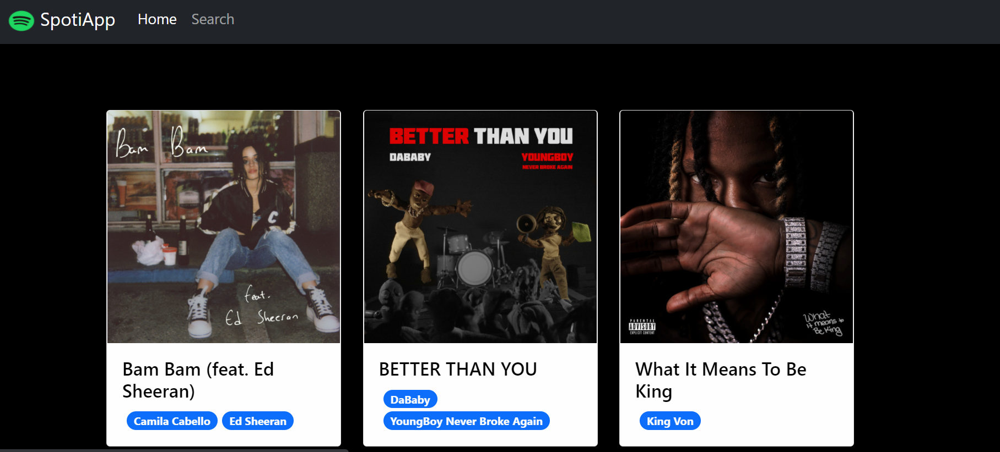

# Hero App

---

### Description
A spotify version, made consuming information using sopotify API. To make it work you will need an api token. The app was made while learning Angular following this great course from Fernando Herrera.

[Udemy - Fernando Herrera - Angular: De cero a experto.](https://www.udemy.com/share/101Wds3@S0opZ16xnJWAL-7hIXfK4Y1e_EOreKyocpG8FYixECNXl13CqSRfa3r39VgOdi_7Hg==/)

---

## Use

To consume information from spotify api you will need to get the token from the web, and paste it in the app service Bearer XXXXXX.
To run the angular application you need to run npm install to get the needed packages and ng serve -o to run it in a local server.

---

## Technologies

- Angular
- Type Script
- Bootstrap

---
## Author Info

- Linkedin - [Federico Andrés Jácome Castañeda](https://www.linkedin.com/in/federicojacome/)
- Website - [Portfolio](http://fedeandresdeveloper.online/)

[Back To The Top](#read-me-template)
